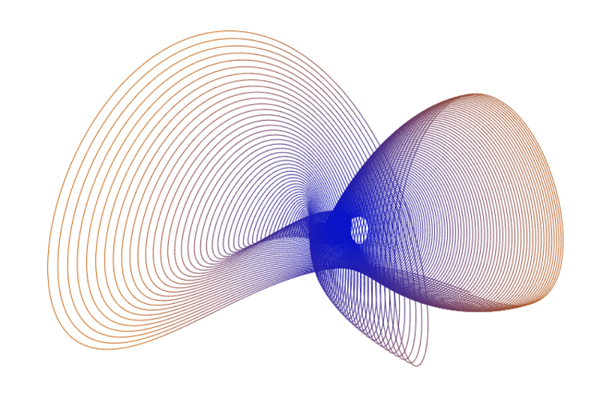

# Digital Harmonograph Simulation

A browser simulation of the Victorian-era pendulum device to draw patterns on paper.

Here is the [live demo](https://gje7g.csb.app/) using CodeSandbox.

Here is the [sandbox](https://codesandbox.io/s/harmonograph-gje7g) itself, if you want to tinker with the code live.
